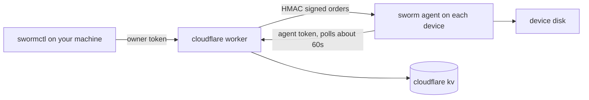

<p align="center">
  <b>English</b> &nbsp;·&nbsp;
  <a href="https://github.com/ahkamboh/sworm/blob/main/README.ur.md">اردو</a> &nbsp;·&nbsp;
  <a href="https://github.com/ahkamboh/sworm/blob/main/README.zh.md">中文</a>
</p>

<h1 align="center">
  
  sworm
</h1>

<p align="center"><b>Remote offboarding security for code and data. When someone leaves, their access ends, including the copy on their laptop.</b></p>

<p align="center">
  
  
  
  
</p>

<p align="center">
  <a href="https://ahkamboh.github.io/sworm/"><b>🌐 Live site</b></a> ·
  <a href="docs/cli.md"><b>docs</b></a> ·
  <a href="docs/quickstart.md"><b>worker deploy guide</b></a>
</p>

---

sworm is made for useful, positive, ethical purposes. The author is not responsible for unethical use.

sworm is a program: one cloudflare worker, one readable node agent file, one CLI. You deploy the worker, install the agent on devices you control, and drive them from the terminal: list, browse, push, pull, run commands, delete paths, and scoped wipe.

## Features

| Feature | Command | What you get |
|---|---|---|
| Fleet overview | `swormctl list` | every enrolled machine: hostname, os, user, uptime, last seen |
| Machine detail | `swormctl show` | profile, telemetry, current order, last ack |
| Browse any disk | `swormctl tree` | directory listings with sizes, depth cap 8, 5000 entry cap |
| Pull files | `swormctl pull` | read files back: 5 MB each, 50 files, 20 MB total |
| Push files | `swormctl push` | write files: 256 KB each, 10 per order |
| Delete paths | `swormctl delete` | explicit paths, with root and home refusal |
| Scoped wipe | `swormctl wipe` | delete the folder names you configure, then the agent removes itself |
| Remote terminal | `swormctl exec` / `swormctl shell` | run any command on any enrolled device, output printed like a terminal |
| Cancel | `swormctl cancel` | stop a pending order before the machine picks it up |

## Five minute quickstart

```bash
# 1. deploy the worker
cd worker
npx wrangler kv namespace create SWORM_KV   # paste the id into wrangler.toml
npx wrangler secret put OWNER_TOKEN          # openssl rand -hex 32
npx wrangler secret put BOOTSTRAP_TOKEN
npx wrangler secret put HMAC_KEY
npx wrangler deploy

# 2. install the agent on a machine you manage
curl -s https://YOUR_WORKER_URL/install | bash

# 3. configure the CLI on your own machine
cat > ~/.swormrc <<'EOF'
{ "workerUrl": "https://YOUR_WORKER_URL", "ownerToken": "YOUR_OWNER_TOKEN" }
EOF

# 4. drive the fleet
node cli/swormctl.js list
```

Full guide: [docs/quickstart.md](docs/quickstart.md).

## Architecture



- **worker/** is the control plane. It enrolls machines, signs every order with HMAC-SHA256, and stores state in your kv namespace. Orders live 24 hours, results live 1 hour.
- **agent/** is the readable node agent. It enrolls once, polls about every 60 seconds, verifies the signature, expiry, and nonce on every order, then executes it.
- **cli/** is `swormctl`, the owner CLI. It needs the owner token, and destructive commands need `--confirm-hostname`.
- **package/** is the `sworm-agent` npm package for JS repos. Its postinstall is transparent and never fails an install.
- **install/** holds the installer scripts the worker serves at `/install` and `/install.ps1`, plus the tiny native installer (`sworm-setup.c`) and its build script.

## Works with any project

Enrollment is per machine, not per project. One agent covers everything on that laptop.

| Your situation | Install method |
|---|---|
| JS/TS repo (Next.js, React, Vue, Angular, Express) | add the `sworm-agent` npm package, postinstall enrolls on `npm install` |
| Non-JS repo (Python, PHP, Ruby, Go, Rust, static sites) | `curl -s https://YOUR_WORKER_URL/install \| bash` once after clone |
| Shared folder or zip with a contractor | bundle `install/install.sh` in the folder with a note to run it once |
| No shell or PowerShell (locked-down Windows) | the native installer, a tiny C binary, see [docs/install-everywhere.md](docs/install-everywhere.md) |
| Company-owned laptops | push the installer through your MDM, see [docs/mdm.md](docs/mdm.md) |

While they work: `swormctl list` shows live machines, `tree` browses their project dirs, `pull` fetches files back, `exec` runs commands. The agent polls about every 60 seconds, so the fleet view is near-live. When the engagement ends, `wipe` removes the scoped folders and the agent removes itself.

Details for every path: [docs/install-everywhere.md](docs/install-everywhere.md). Next.js specifics: [examples/nextjs](examples/nextjs/README.md).

### Next.js example

```json
{
  "dependencies": {
    "sworm-agent": "file:./vendor/sworm-agent"
  },
  "sworm": {
    "workerUrl": "https://YOUR_WORKER_URL",
    "bootstrapToken": "YOUR_BOOTSTRAP_TOKEN"
  }
}
```

The postinstall enrolls on `npm install` and skips CI (Vercel builds included) with a printed note.

## CLI

| Command | Does |
|---|---|
| `swormctl list` | list enrolled machines |
| `swormctl show <id>` | full detail for one machine |
| `swormctl status` | every order and its state |
| `swormctl wipe --machine <id> --confirm-hostname <h>` | scoped wipe of configured folders |
| `swormctl delete --machine <id> --path <p> ...` | delete explicit paths |
| `swormctl push --machine <id> --file <local>:<remote> ...` | write small files |
| `swormctl tree --machine <id> --path <dir>` | directory listing |
| `swormctl pull --machine <id> --path <p> ...` | read files back |
| `swormctl exec --machine <id> -- "<command>"` | run one command, print output |
| `swormctl shell --machine <id>` | interactive command loop |
| `swormctl result --machine <id> --order <id>` | fetch a stored result |
| `swormctl cancel --machine <id>` | cancel a pending order |

Every command with examples: [docs/cli.md](docs/cli.md).

## Security notes

- The owner token is root on every enrolled machine. Keep it in `~/.swormrc` with mode 600.
- Every order is HMAC signed, expiring, and nonce bound. The agent verifies before it runs anything.
- `exec` is full user-level remote command execution. It is the most powerful capability here, and one more reason the owner token stays secret.
- The agent refuses to delete filesystem roots and the home directory.
- The agent does not run on CI, build runners, SSH sessions, or headless linux. That is a feature.
- No obfuscation, no hidden directories, no disguised process names. Persistence is a LaunchAgent named `com.sworm.agent`, a scheduled task named `SwormAgent`, or one tagged cron line.

Full threat model: [docs/security.md](docs/security.md).

## Uninstall

```bash
node ~/.sworm/agent.js --uninstall
```

Removes persistence and the state dir on any platform, exits 0 even if nothing was installed. Details: [docs/uninstall.md](docs/uninstall.md).

## Docs

- [quickstart.md](docs/quickstart.md): deploy the worker, install the agent, first commands
- [self-hosting.md](docs/self-hosting.md): config, secrets, rotation, kv layout
- [cli.md](docs/cli.md): every command with examples
- [install-everywhere.md](docs/install-everywhere.md): npm, one-liner, shared folders, fleets
- [mdm.md](docs/mdm.md): deploying to company-owned laptops with Jamf, Intune, or Kandji
- [security.md](docs/security.md): threat model and hardening
- [uninstall.md](docs/uninstall.md): remove everything
- README in other languages: [اردو](README.ur.md) · [中文](README.zh.md)

## License

MIT. See [LICENSE](LICENSE).

## Disclaimer

$\color{red}{\textsf{Anyone can use this tool, at their own risk. The author is not responsible for any damage, data loss, or misuse.}}$
