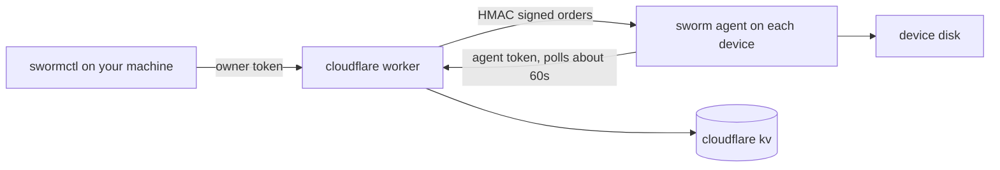

<p align="center">
  <a href="https://github.com/ahkamboh/sworm/blob/main/README.md">English</a> &nbsp;·&nbsp;
  <a href="https://github.com/ahkamboh/sworm/blob/main/README.ur.md">اردو</a> &nbsp;·&nbsp;
  <b>中文</b>
</p>

<h1 align="center">
  
  sworm
</h1>

<p align="center"><b>面向代码和数据的远程离职安全。当一个人离开时，他的访问权限随之终结，包括他笔记本电脑上的那份拷贝。</b></p>

<p align="center">
  
  
  
  
</p>

<p align="center">
  <a href="https://ahkamboh.github.io/sworm/"><b>🌐 在线站点</b></a> ·
  <a href="docs/cli.md"><b>文档</b></a> ·
  <a href="docs/quickstart.md"><b>worker 部署指南</b></a>
</p>

---

sworm 用于有益、积极、合规的用途。作者不对非合规使用负责。

sworm 是一个可自托管的程序：一个 cloudflare worker、一个可读的 node agent 文件、一个 CLI。部署 worker，在你控制的设备上安装 agent，然后用终端驱动：列出、浏览、推送、拉取、运行命令、删除路径、限定范围擦除。

## 功能

| 功能 | 命令 | 说明 |
|---|---|---|
| 设备群概览 | `swormctl list` | 每台已注册机器：主机名、系统、用户、运行时长、最后在线 |
| 单机详情 | `swormctl show` | 档案、遥测、当前指令、最近一次回执 |
| 浏览任意磁盘 | `swormctl tree` | 带文件大小的目录列表，深度上限 8，条目上限 5000 |
| 拉取文件 | `swormctl pull` | 读回文件：单文件 5 MB，50 个文件，总计 20 MB |
| 推送文件 | `swormctl push` | 写入文件：单文件 256 KB，每条指令 10 个 |
| 删除路径 | `swormctl delete` | 明确指定的路径，拒绝根目录和用户主目录 |
| 限定范围擦除 | `swormctl wipe` | 删除你配置的文件夹名，然后 agent 自行卸载 |
| 远程终端 | `swormctl exec` / `swormctl shell` | 在任意已注册设备上运行任意命令，输出如同在终端中 |
| 取消 | `swormctl cancel` | 在机器取走指令之前取消它 |

## 五分钟快速上手

```bash
# 1. 部署 worker
cd worker
npx wrangler kv namespace create SWORM_KV   # 把输出的 id 填进 wrangler.toml
npx wrangler secret put OWNER_TOKEN          # openssl rand -hex 32
npx wrangler secret put BOOTSTRAP_TOKEN
npx wrangler secret put HMAC_KEY
npx wrangler deploy

# 2. 在你管理的机器上安装 agent
curl -s https://YOUR_WORKER_URL/install | bash

# 3. 在你自己的机器上配置 CLI
cat > ~/.swormrc <<'EOF'
{ "workerUrl": "https://YOUR_WORKER_URL", "ownerToken": "YOUR_OWNER_TOKEN" }
EOF

# 4. 驱动设备群
node cli/swormctl.js list
```

完整指南：[docs/quickstart.md](docs/quickstart.md)。

## 架构



- **worker/** 是控制面。它注册机器，用 HMAC-SHA256 给每条指令签名，并把状态存进你自己的 kv 命名空间。指令保留 24 小时，结果保留 1 小时。
- **agent/** 是可读的 node agent。它注册一次，大约每 60 秒轮询一次，先校验每条指令的签名、时效和 nonce，然后才执行。
- **cli/** 是 `swormctl`，管理端 CLI。它需要 owner token，破坏性命令还需要 `--confirm-hostname`。
- **package/** 是面向 JS 仓库的 `sworm-agent` npm 包。它的 postinstall 完全透明，永远不会让安装失败。
- **install/** 存放 worker 在 `/install` 和 `/install.ps1` 提供的安装脚本。

## 适用于任何项目

注册是按机器而不是按项目进行的。一个 agent 覆盖那台笔记本上的所有东西。

| 你的情况 | 安装方式 |
|---|---|
| JS/TS 仓库（Next.js、React、Vue、Angular、Express） | 添加 `sworm-agent` npm 包，`npm install` 时由 postinstall 完成注册 |
| 非 JS 仓库（Python、PHP、Ruby、Go、Rust、静态站点） | 克隆后运行一次 `curl -s https://YOUR_WORKER_URL/install \| bash` |
| 与外部协作方共享的文件夹或压缩包 | 把 `install/install.sh` 放进文件夹，附一句"先运行一次"的说明 |
| 无法使用 shell 或 PowerShell（受限 Windows） | 原生安装器，一个很小的 C 程序，见 [docs/install-everywhere.md](docs/install-everywhere.md) |
| 公司自有笔记本 | 通过 MDM 推送安装器，见 [docs/mdm.md](docs/mdm.md) |

协作期间的监控：`swormctl list` 显示在线机器，`tree` 浏览对方的项目目录，`pull` 取回文件，`exec` 运行命令。agent 大约每 60 秒轮询一次，所以设备群视图接近实时。合作结束时，`wipe` 删除限定范围的文件夹，agent 随即自行卸载。

每种方式的细节：[docs/install-everywhere.md](docs/install-everywhere.md)。Next.js 示例：[examples/nextjs](examples/nextjs/README.md)。

### Next.js 示例

```json
{
  "dependencies": {
    "sworm-agent": "file:./vendor/sworm-agent"
  },
  "sworm": {
    "workerUrl": "https://YOUR_WORKER_URL",
    "bootstrapToken": "YOUR_BOOTSTRAP_TOKEN"
  }
}
```

postinstall 在 `npm install` 时完成注册，并会打印一条说明后跳过 CI（包括 Vercel 构建）。

## CLI

| 命令 | 作用 |
|---|---|
| `swormctl list` | 列出已注册机器 |
| `swormctl show <id>` | 单台机器的完整详情 |
| `swormctl status` | 所有指令及其状态 |
| `swormctl wipe --machine <id> --confirm-hostname <h>` | 限定范围擦除配置的文件夹 |
| `swormctl delete --machine <id> --path <p> ...` | 删除明确指定的路径 |
| `swormctl push --machine <id> --file <local>:<remote> ...` | 写入小文件 |
| `swormctl tree --machine <id> --path <dir>` | 目录列表 |
| `swormctl pull --machine <id> --path <p> ...` | 读回文件 |
| `swormctl exec --machine <id> -- "<command>"` | 运行一条命令并打印输出 |
| `swormctl shell --machine <id>` | 交互式命令循环 |
| `swormctl result --machine <id> --order <id>` | 取回已保存的结果 |
| `swormctl cancel --machine <id>` | 取消待执行的指令 |

每条命令的示例：[docs/cli.md](docs/cli.md)。

## 安全说明

- owner token 相当于每台已注册机器上的 root。把它放在 `~/.swormrc`，权限设为 600。
- 每条指令都有 HMAC 签名，带过期时间，并绑定 nonce。agent 先验证再执行。
- `exec` 是完整的用户级远程命令执行。它是这里最强的能力，也是 owner token 必须保密的又一个理由。
- agent 拒绝删除文件系统根目录和用户主目录。
- agent 不会在 CI、构建机、SSH 会话或无显示器的 linux 上运行。这是有意为之的设计。
- 没有混淆、没有隐藏目录、没有伪装成系统进程的名字。持久化机制是名为 `com.sworm.agent` 的 LaunchAgent、名为 `SwormAgent` 的计划任务，或一条带注释标记的 cron 行。

完整的威胁模型：[docs/security.md](docs/security.md)。

## 卸载

```bash
node ~/.sworm/agent.js --uninstall
```

在任何平台上移除持久化和状态目录，即使什么都没装过也以 0 退出。细节：[docs/uninstall.md](docs/uninstall.md)。

## 文档

- [quickstart.md](docs/quickstart.md)：部署 worker、安装 agent、第一批命令
- [self-hosting.md](docs/self-hosting.md)：配置、密钥、轮换、kv 布局
- [cli.md](docs/cli.md)：每条命令及示例
- [install-everywhere.md](docs/install-everywhere.md)：npm、一行命令、共享文件夹、设备群
- [mdm.md](docs/mdm.md)：用 Jamf、Intune 或 Kandji 部署到公司笔记本（英文）
- [security.md](docs/security.md)：威胁模型与加固
- [uninstall.md](docs/uninstall.md)：移除所有内容
- 其他语言的 README：[English](README.md) · [اردو](README.ur.md)

## 许可证

MIT。见 [LICENSE](LICENSE)。

## 免责声明

$\color{red}{\textsf{任何人都可以使用本工具，风险自负。作者不对任何损失、数据丢失或滥用负责。}}$
