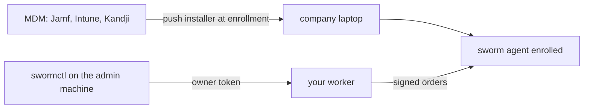

# Deploying with MDM

This doc covers company-owned laptops. When the company owns the hardware, IT pushes the agent through the management plane before the laptop reaches the employee. That is the standard model for fleet software: the same way CrowdStrike or Jamf's own agent lands on a machine.

Two things stay true on this path, same as everywhere else in sworm:

- The agent is visible in the system. The state dir is `~/.sworm`, the persistence entries are named `com.sworm.agent` and `SwormAgent`, and the process list shows node running a readable file.
- Removal is controlled by IT through the MDM profile and admin credentials, not by hiding anything from the person holding the machine.

For machines you do not own (contractors, personal laptops), use the consent-based path instead: send the installer, tell them what it does, and let them run it. See [install-everywhere.md](install-everywhere.md).

## The flow



The installer is the same script everywhere: `install/install.sh` for macOS, `install/install.ps1` for windows, or the one-liner against your worker. The only difference in MDM is who runs it and where the bootstrap token lives.

## Token handling

Never bake the bootstrap token into a shared disk image, a repo, or a script in version control. Store it in the MDM's secret or variable store and reference it at run time. Every MDM below has one.

The blast radius is small if it leaks anyway: the bootstrap token can only enroll machines. It cannot issue orders, read results, or touch the fleet. Rotate it with `npx wrangler secret put BOOTSTRAP_TOKEN` if it ever escapes.

## Jamf Pro

1. Add a script under Settings, Computer management, Scripts. Paste in `install/install.sh` with the worker url filled in, and read the token from a script parameter:

```sh
#!/bin/sh
# parameter 4 holds the bootstrap token from the Jamf policy
SWORM_WORKER_URL="https://YOUR_WORKER_URL"
SWORM_BOOTSTRAP_TOKEN="$4"
SWORM_AGENT_URL="https://raw.githubusercontent.com/YOUR_GITHUB_USER/sworm/main/agent/agent.js"
export SWORM_WORKER_URL SWORM_BOOTSTRAP_TOKEN SWORM_AGENT_URL
# then the body of install/install.sh, with the three placeholder
# lines removed since the values come from above
```

2. Create a policy, scope it to the smart group for the fleet, set the trigger to Enrollment Complete, and pass the token as parameter 4.
3. The agent enrolls at first login and appears in `swormctl list`.

A pkg built with `pkgbuild` that runs the same script as a postinstall works too, if you prefer packages over script policies.

## Microsoft Intune

For windows devices:

1. Wrap the installer as a Win32 app with the Intune content prep tool. The install command runs the PowerShell installer:

```
powershell.exe -ExecutionPolicy Bypass -File install.ps1
```

2. Fill the worker url and agent url in `install.ps1`, and read the token from a variable you inject at packaging time from your secret store.
3. Detection rule: file exists, `%USERPROFILE%\.sworm\agent.js`.
4. Assign to the device group. The agent enrolls at next logon.

A single executable works too: wrap `install/dist/sworm-setup-windows.exe` (built with `install/build-binaries.sh`) as the Win32 app instead of the PowerShell script, and pass the worker url and token as environment variables in the install command. Same detection rule.

For macOS devices in Intune, use a shell script assignment with `install.sh` and the same detection path.

## Kandji

1. Add a custom app library item.
2. Audit script: check for `~/.sworm/agent.js` and exit 1 when missing so Kandji installs it.
3. Install script: the contents of `install/install.sh`, token referenced from a Kandji variable.
4. Assign to the blueprint for the fleet. Runs at enrollment.

## Any other MDM

Any tool that can run a shell script at enrollment works. The whole job is: run the installer as the user (or as root, see below), with the token coming from the tool's variable store. The one-liner form is fine too:

```sh
curl -s https://YOUR_WORKER_URL/install | bash
```

## A note on running as root

MDM scripts usually run as root. The sworm agent is a per-user agent: its state dir and persistence live in the user's home and user session. Have your script write into the target user's home and load the LaunchAgent into the user's gui session, or simplest, have the MDM drop a small launcher that runs the installer once at the user's first login. Jamf's Enrollment Complete trigger and Kandji's blueprint both give you that moment.

## Removal control

Uninstall goes through IT:

- Push an MDM script that runs `node ~/.sworm/agent.js --uninstall` for the user, or
- run it remotely from your terminal: `swormctl exec --machine <id> --confirm-hostname <h> -- "node ~/.sworm/agent.js --uninstall"`.

When the agent was installed by IT with admin-controlled persistence, a local user without admin rights cannot remove the management plane. That is a fact of the MDM model, not a sworm trick: the same is true of any fleet agent.

## Offboarding tie-in

When an employee leaves:

1. Revoke their accounts as usual.
2. Before the laptop comes back (or the moment it is back on the network), run the offboarding flow: `swormctl wipe --machine <id> --folders "your-project-folders" --confirm-hostname "<hostname>"`.
3. Confirm `completed` in `swormctl status`.
4. Uninstall the agent through the MDM so the machine is clean for the next person.

The wipe order's default is to remove the agent after a clean wipe, so steps 2 and 4 can be one step. Pass `--keep-agent` when the laptop stays in the fleet and only the project data should go.
