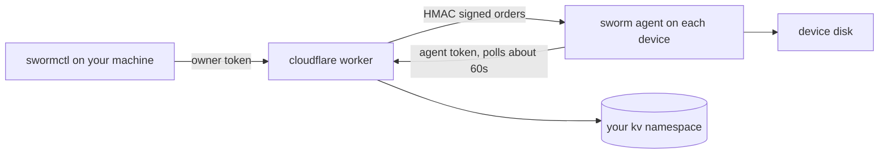

# Self-hosting

sworm is yours. The worker runs in your cloudflare account, the data lives in your kv namespace, and the agents only ever talk to your worker.

## Pieces



| Piece | Where it runs | What it stores |
|---|---|---|
| worker | your cloudflare account | code only |
| kv namespace | your cloudflare account | machine profiles, tokens, orders, results |
| agent | each managed machine | `~/.sworm`: config and its machine credentials |
| swormctl | your machine | `~/.swormrc`: worker url and owner token |

## wrangler.toml reference

| Field | Required | Meaning |
|---|---|---|
| `name` | yes | worker name, becomes part of the default url |
| `kv_namespaces` | yes | binding `SWORM_KV`, paste your namespace id |
| `AGENT_URL` | recommended | where the installer downloads `agent.js` from, usually the raw github url of your fork |
| `WIPE_FOLDERS` | no | comma separated folder names a wipe targets when the order names none |
| `SEARCH_ROOTS` | no | comma separated home-relative roots a wipe searches |

## Secrets

Set with `npx wrangler secret put <NAME>`:

| Secret | Who holds it | What it opens |
|---|---|---|
| `OWNER_TOKEN` | you, in `~/.swormrc` | every `/v1/owner/*` route |
| `BOOTSTRAP_TOKEN` | the installer, embedded in `/install` | `/v1/enroll` and the agent download |
| `HMAC_KEY` | worker and enrolled agents | signs and verifies order envelopes |

Generate each with `openssl rand -hex 32`.

### Rotating

- `OWNER_TOKEN`: put the new secret, update `~/.swormrc`. Agents are unaffected.
- `BOOTSTRAP_TOKEN`: put the new secret. Already enrolled agents keep working (they use their own agent tokens). New installs need the fresh installer.
- `HMAC_KEY`: put the new secret, then re-enroll machines (delete `~/.sworm/machine.json` on each and restart the agent). Agents verify orders with the key they got at enroll, so a rotated key stops old agents from accepting orders until they re-enroll.

## Custom domain

The default `workers.dev` url works fine. To use your own domain:

```bash
npx wrangler domains add sworm.example.com
```

Then update `~/.swormrc` and reinstall agents (or edit `~/.sworm/config.json` on each machine).

## kv layout

```
machine:<id>:profile     hostname, os, hardware, user, enrolledAt
machine:<id>:auth        agentToken, issuedAt
machine:<id>:telemetry   lastSeen, geo, uptime
token:<agentToken>       machineId (auth index)
order:<id>               the current order for a machine, 24h TTL
order:<id>:ack           outcome of the last order, 24h TTL
result:<id>:<orderId>    tree, pull, or exec output, 1h TTL
```

## Upgrading the agent

Agents run the source served at enroll time. To ship a new agent version:

1. Update `agent/agent.js` in your fork.
2. Redeploy the worker (no code change needed, but it clears caches).
3. On each machine, replace `~/.sworm/agent.js` with the new file and restart the agent. Or push the new file with `swormctl push` and restart with `swormctl exec -- "launchctl kickstart -k gui/$(id -u)/com.sworm.agent"` on macOS.

## Costs

The cloudflare free plan covers a small fleet comfortably: the worker only wakes on polls and CLI calls, and each machine polls about 1440 times a day. kv stores at most a few KB per machine plus results, which expire after an hour.
